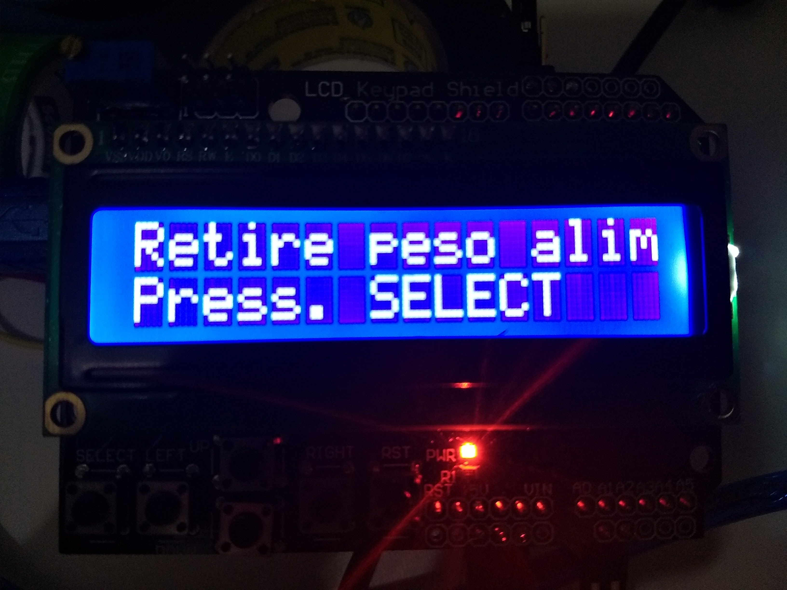

# Auto Feeder

 .  . 

 .  . 

 .  . 

[Vídeo demonstrativo](imagens/VID_20180519_234616465.mp4)

Alimentador automatico com timer e controle de peso / Automatic feeder with timer and weight control

Projeto envolve conceitos de temporização, ações de botões, display, atualização de display e controle de loop para leitura dos sensores utilizando UPS. / Project involves timing concepts, button actions, display, display update and loop control for reading
of sensors using UPS.

## Fluxograma do projeto

## Sensores utilizados

- Sensor de peso HX711
- Modulo com Display LiquidCrystal 16x2 e botões
- Relê para acionar motor com redução.
